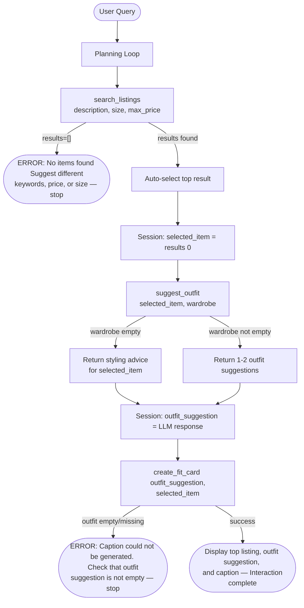

# FitFindr — planning.md

> Complete this document before writing any implementation code.
> Your spec and agent diagram are what you'll use to direct AI tools (Claude, Copilot, etc.) to generate your implementation — the more specific they are, the more useful the generated code will be.
> Your planning.md will be reviewed as part of your submission.
> Update it before starting any stretch features.

---

## Tools

List every tool your agent will use. For each tool, fill in all four fields.
You must have at least 3 tools. The three required tools are listed — add any additional tools below them.

### Tool 1: search_listings

**What it does:**
<!-- Describe what this tool does in 1–2 sentences -->

This searches using keywords to find items that match the parameters used. It returns a dictionary of the relevant items with all their information like id, title, description, category, and more.

**Input parameters:**
<!-- List each parameter, its type, and what it represents -->

- `description` (str): keywords describing what the user is looking for
- `size` (str): Optional input, represents size of the clothing 
- `max_price` (float): Optional input, represents inclusive max price of the clothing item

**What it returns:**
<!-- Describe the return value — what fields does a result contain? -->

Returns a list of dicts that are sorted by relevance, where most relevant is the first item. Each of these dicts contain all the fields that are listed in listing.json, such as (id, title, description , category, etc.)

**What happens if it fails or returns nothing:**
<!-- What should the agent do if no listings match? -->

It should return an empty list and tell the user that no clothing can be found with the search results used. This should then prompt the user to search again using something else.

---

### Tool 2: suggest_outfit

**What it does:**
<!-- Describe what this tool does in 1–2 sentences -->

This tool looks at any new thrifted clothing items the user has purchased and compares it with their wardrobe. It then suggests 1-2 outfits for the user that has this new clothing item included in it. If the wardrobe is empty it instead suggests styling advice.

**Input parameters:**
<!-- List each parameter, its type, and what it represents -->

- `new_item` (dict): Contains the information on the item the user wants to purchase next
- `wardrobe` (dict): a dict with an items key that has a list of item dicts.

**What it returns:**
<!-- Describe the return value -->

Returns a string with outfit suggestions using the new item and the wardrobe, if the wardrobe is empty it instead returns styling advice using the new item.

**What happens if it fails or returns nothing:**
<!-- What should the agent do if the wardrobe is empty or no outfit can be suggested? -->

It  should return a string that gives styling advice for the new item that the user wants to purchase.

---

### Tool 3: create_fit_card

**What it does:**
<!-- Describe what this tool does in 1–2 sentences -->

This tool should take the outfit that was suggested from the suggest_outfit function and the new item the user purchased, to then create a 2-4 sentence social media caption for the user to post.

**Input parameters:**
<!-- List each parameter, its type, and what it represents -->

- `outfit` (str):  One of the outfits suggested from suggest_outfit function
- `new_item` (dict):  The new thrifted item that the user purchased 

**What it returns:**
<!-- Describe the return value -->

Returns a 2-4 sentence message that the user can put on a social media caption for their new outfit that was made using the new thrifted item. 

**What happens if it fails or returns nothing:**
<!-- What should the agent do if the outfit data is incomplete? -->

If the outfit data is incomplete the agent should return a message to the user that states what is missing.

---

### Additional Tools (if any)

<!-- Copy the block above for any tools beyond the required three -->

---

## Planning Loop

**How does your agent decide which tool to call next?**
<!-- Describe the logic your planning loop uses. What does it look at? What conditions change its behavior? How does it know when it's done? -->

The agent first extracts description, size, and max_price from the users query and calls search_listings with this information. If the result is an empty list, the agent sets an error message telling the user no results were found and prompts them to try a different search. 

If results are returned, the agent displays each listing's information just like listing.json where each listing has its own id, title, description, etc. The selected item should be stored in session["selected_item"].

Next the agent calls suggest_outfit(new_item = selected_item, wardrobe = session["wardrobe"]). If the string returned is empty, the agent returns styling advice for the item. Otherwise it displays the 1-2 outfit suggestions. Then store one of the outfits in session["outfit_suggestion"].

Lastly the agent calls create_fit_card(outfit = outfit_suggestion, new_item = selected_item). If the outfit is missing or empty return an error message stating something went wrong. Otherwise it should display the outfit its description and the caption for the user to copy and paste. 

---

## State Management

**How does information from one tool get passed to the next?**
<!-- Describe how your agent stores and accesses state within a session. What data is tracked? How is it passed between tool calls? -->

The state within a session lives in a single session dict. Search_listings results go into session["search_results"], the top result into session["selected_item"]. That item passes into suggest_outfit, which sotres its output in session["outfit_suggestion"]. Both feed into create_fit_card, which stores the caption in session["fit_card"]. If any step fails, session["error"] makes the loop return early.

---

## Error Handling

For each tool, describe the specific failure mode you're handling and what the agent does in response.

| Tool | Failure mode | Agent response |
|------|-------------|----------------|
| search_listings | No results match the query | No items found. Then prompt the user to retry |
| suggest_outfit | Wardrobe is empty | Return styling advice to the user for the selected item|
| create_fit_card | Outfit input is missing or incomplete | ERROR: Outfit suggestion is missing. Try searching for a different item.|

---

## Architecture

---

## AI Tool Plan

<!-- For each part of the implementation below, describe:
     - Which AI tool you plan to use (Claude, Copilot, ChatGPT, etc.)
     - What you'll give it as input (which sections of this planning.md, your agent diagram)
     - What you expect it to produce
     - How you'll verify the output matches your spec before moving on

     "I'll use AI to help me code" is not a plan.
     "I'll give Claude my Tool 1 spec (inputs, return value, failure mode) and ask it to implement
     search_listings() using load_listings() from the data loader — then test it against 3 queries
     before trusting it" is a plan. -->

**Milestone 3 — Individual tool implementations:**

For each of the 3 tools I'll use Claude. For search_listings, I'll give Claude the Tool 1 block from planning.md with the inputs, return value, and failure mode, alongside the Architecutre diagram. Then I will ask it to implement the function using the load_listings function from data_loader.py. I'll verify the output filters correctly by size, max_price, and keyword score, handles negative max_orice, and returns an empty list when nothing matches, then I will test with 3 queries. 

For suggest_outfit, I'll give Claude the Tool 2 block and ask it to implement both branches (empty wardrobe -> styling advice, wardrobe not empty -> outfit suggestions using pieces). I'll verify it handles the empty wardrobe case without an error and returns a non-empty string in both cases. 

For create_fit_card, I'll give Claude the Tool 3 block and ask it to generate a casual 2-4 sentence caption for social media. I'll verify it mentions the new item name, price, and platform. I will also check to see that passing an empty outfit string returns an error message instead of raising an exception.

**Milestone 4 — Planning loop and state management:**

For the planing loop I'll give Claude the Planning Loop section, State Management section, and the mermaid diagram from planning.md and ask it to implement run_agent() in agent.py. I expect it to produce a function that parses the query so that description, size, and max_price can be recieved to call the 3 tools. I also expect it to call all 3 tools in sequence, store results in session dict, and return early with a descriptive error if search_listings returns nothing. I'll verify it by running the test cases at the bottom of agent.py, where the no-results query should return a non-None error with an empty fit_card.

---

## A Complete Interaction (Step by Step)

Write out what a full user interaction looks like from start to finish — tool call by tool call. Use a specific example query.

**Example user query:** "I'm looking for a vintage graphic tee under $30. I mostly wear baggy jeans and chunky sneakers. What's out there and how would I style it?"

**Step 1:**
<!-- What does the agent do first? Which tool is called? With what input? -->

The agent should first use the search_listing function based on the users query. This is to find relevant clothing options for the user. search_listings(
description = "vintage graphic tee",
size = None,
max_price = 30.0     
)

**Step 2:**
<!-- What happens next? What was returned from step 1? What tool is called now? -->

Step 1 returns a list of dicts that are sorted by relevance where most relevant is the first. The agent should then call suggest_outfit based on the most relevant item.

**Step 3:**
<!-- Continue until the full interaction is complete -->

Step 2 returns a string of outfit suggestions or ways to style the new thrifted clothing piece. After this create_fit_card should be called on one of the outfits made and return the social media caption for the post.

**Final output to user:**
<!-- What does the user actually see at the end? -->

The user sees the choosen outfit description and the generated caption that they can copy and use to post.